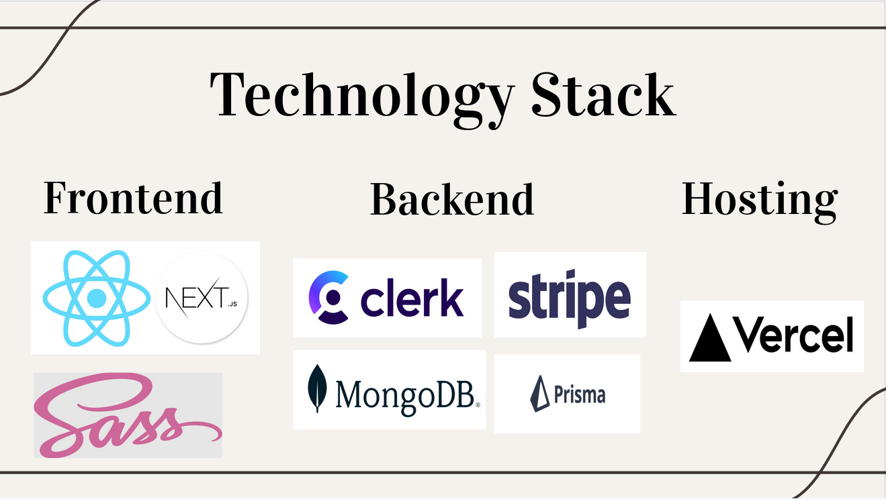

<p align="center">
    
 </p>

## What is ‘The Loop’?

The Loop is an e-commerce site that will provide a platform for users to buy & sell pre-loved items, within a wide range of categories.

## Our idea

As a lot of commerce are done online today, we wanted a way for customers of this niche to be able to connect with each other and appreciate their love for the vintage while helping in our mission towards sustainability and eco-commerce movements.

## Our group

Our group is made up of four young individuals namely :

- Andreea-Irina Dica 

- Gabriel M. Dawson-Amoah

- Leigh Richards

- Sm Shahniaz

## Tech Stack

- **Frontend:** React , Next.js 14, Sass
- **Backend:** Prisma (ORM), MongoDB
- **API:** Clerk (authentication) , Stripe (Payment)
- **Hosting**: Vercel



## Getting Started

##### 1. Clone the Repository

   ```bash
    git clone https://github.com/sshahniaz/the-loop.git
   ```

##### 2. Environment Variables

- Create a ``` .env.local ``` file in the project root.
- Add any environment variables required by the application (e.g., database connection details, Clerk and Stripe keys).
- **Note:** ``` .env.local ``` is not committed to version control for security reasons.

##### 3. Install dependencies & Run

```bash
# install all dependencies if you are running from a new machine run below for all the deve pedendecies
npm i
# generate prisma
npx prisma generate

npm run dev
# or
yarn dev
# or
pnpm dev
# or
bun dev
```

Open [http://localhost:3000](http://localhost:3000) with your browser to see the result.

## Project Structure

- ``` app ``` : Contains all the application pages, components, server actions.
- ``` app/(page name) ``` : Contains all the application  pages (e.g app/profile contains the profile page).
- ``` app/components ``` : Contains all the application  components.
- ``` app/actions ``` : Contains all the server actions.
- ``` app/api ``` : Contains all the application APIs and API routes.
- ``` prisma ``` : Contains ``` schema.prisma ``` and all related config files.
- ``` public ``` : Contains all the assets(images), fonts and styles.

## Contributing

We welcome contributions to this project! Please create a pull request with your changes and adhere to the following guidelines:
- Follow the existing code style and formatting.
- Write clear and concise commit messages.
- Add unit tests for your changes (optional but encouraged).

<!-- ## License

  - This project is licensed under the MIT License. See the LICENSE file for details. -->